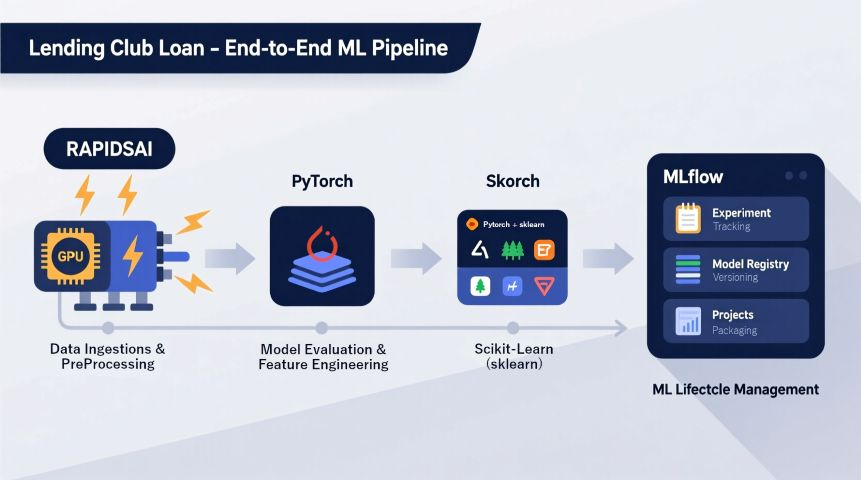

# Lending Club Loan Default Prediction Project

This repository contains an end-to-end Lending Club loan default prediction microproject:
data loading & cleaning, feature engineering, hyperparameter tuning, final training with MLflow tracking and model registry, and a FastAPI inference service that automatically loads the production (champion) model.



## Quick Links
- Pipeline entry: [scripts/run_pipeline.py](scripts/run_pipeline.py) — see [`main`](scripts/run_pipeline.py).
- Promotion utility: [scripts/promote_model.py](scripts/promote_model.py) — see [`promote_candidate_to_champion`](scripts/promote_model.py).
- FastAPI service: [deployment/fastapi_service/main.py](deployment/fastapi_service/main.py) — see [`load_champion_model`](deployment/fastapi_service/main.py) and [`model_polling_task`](deployment/fastapi_service/main.py).
- Data loading & preprocessing: [src/data_processing/loader.py](src/data_processing/loader.py) (`load_and_clean_data`) and [src/data_processing/preprocess.py](src/data_processing/preprocess.py) (`feature_engineer`, `preprocess_dataset`).
- Model code and training: [src/model/trainer.py](src/model/trainer.py) (`run_hpo`, `train_final_model`), [src/model/definition.py](src/model/definition.py), and [src/model/pipeline.py](src/model/pipeline.py) (`ThresholdClassifier`).
- MLflow utilities: [src/utils.py](src/utils.py) (`set_model_alias`, `create_model_signature`).
- Orchestration: [docker-compose.yml](docker-compose.yml).

## Project structure (high level)
- deployment/fastapi_service/
  - main.py — FastAPI app that polls MLflow and serves `/predict` and `/health` endpoints. See [`load_champion_model`](deployment/fastapi_service/main.py).
  - Dockerfile, requirements.txt — container setup for the API.
- scripts/
  - run_pipeline.py — orchestrates data load → HPO → champion training → MLflow logging. Entrypoint: [`main`](scripts/run_pipeline.py).
  - promote_model.py — promotes a `candidate` registry alias to `champion`. Entrypoint: [`promote_candidate_to_champion`](scripts/promote_model.py).
- src/
  - data_processing/loader.py — CSV loading and cleaning (`load_and_clean_data`).
  - data_processing/preprocess.py — feature engineering and temporal splitting (`feature_engineer`, `preprocess_dataset`).
  - model/definition.py — PyTorch DNN architecture.
  - model/trainer.py — HPO (`run_hpo`), final training and MLflow logging (`train_final_model`).
  - model/pipeline.py — `ThresholdClassifier` wrapper used inside the serialized sklearn pipeline.
  - utils.py — MLflow helper functions (`set_model_alias`, `create_model_signature`).
- docker-compose.yml — composes MLflow, MinIO, Postgres, notebook, and FastAPI.

## Scripts explained
- scripts/run_pipeline.py
  - Orchestrates the full pipeline: loads data via [`load_and_clean_data`](src/data_processing/loader.py), applies [`feature_engineer`](src/data_processing/preprocess.py), splits & preprocesses with [`preprocess_dataset`](src/data_processing/preprocess.py).
  - Runs hyperparameter tuning via [`run_hpo`](src/model/trainer.py) (nested MLflow child runs).
  - Trains a champion model via [`train_final_model`](src/model/trainer.py), logs a scikit-learn pipeline (preprocessor + `ThresholdClassifier`) with MLflow, and registers a version under the name in [src/config.py](src/config.py).
  - After a successful champion run, it sets the `candidate` alias using [`set_model_alias`](src/utils.py).

- scripts/promote_model.py
  - Promotes the currently aliased `candidate` model version to `champion` in the MLflow registry by calling [`promote_candidate_to_champion`](scripts/promote_model.py).
  - Uses the `MLFLOW_TRACKING_URI` environment variable (local `.env` supported via python-dotenv).

## Serving & "Pooling" (Polling) strategy with FastAPI
The FastAPI service implements an automated model polling strategy so the API always serves the registry's champion version without manual restarts:

- Initial load
  - On startup the app calls [`load_champion_model`](deployment/fastapi_service/main.py) to resolve the model alias and load the model from the MLflow model URI `models:/{model_name}@{model_alias}`.

- Periodic polling
  - A background task [`model_polling_task`](deployment/fastapi_service/main.py) runs continuously and calls [`load_champion_model`](deployment/fastapi_service/main.py) every 60 seconds (see the implementation). If MLflow reports a newer model version for the configured alias, the API downloads it and atomically replaces the in-memory model.

- Implementation details
  - The runtime state is held in the `model_state` dictionary (`model_state` in [deployment/fastapi_service/main.py](deployment/fastapi_service/main.py)). It contains keys: `"model"`, `"current_version"`, `"model_name"`, and `"model_alias"`.
  - The loader resolves the registry alias via the MLflow client and uses `mlflow.pyfunc.load_model` to get a pyfunc model compatible with `predict(...)`.
  - Prediction endpoint (`/predict`) expects a JSON matching the `LoanApplication` Pydantic schema in [deployment/fastapi_service/main.py](deployment/fastapi_service/main.py), constructs a DataFrame, and calls `model.predict(input_df)`.

- Environment variables required
  - `MLFLOW_TRACKING_URI` — must point to the MLflow server used by training and serving. The FastAPI app fails startup if this is missing.
  - Optionally: `REGISTERED_MODEL_NAME`, `CHAMPION_ALIAS` to override defaults in the code.

## Notes & important patterns
- Temporal splits: splitting is time-based. The split dates live in [src/config.py](src/config.py) as `TRAIN_END_DATE` / `VAL_END_DATE`. Any change to splitting must preserve chronological order.
- Preprocessor + pipeline: the preprocessor is a sklearn ColumnTransformer and is serialized into the MLflow model pipeline. Inference relies on the preprocessor included with the logged pipeline (see [`train_final_model`](src/model/trainer.py) where the `full_pipeline` is built).
- Thresholding: runtime pipeline wraps a skorch model with [`ThresholdClassifier`](src/model/pipeline.py) so the saved pipeline returns class labels (0/1) for `predict`.
- Model registry aliases: the pipeline sets a `candidate` alias after registration using [`set_model_alias`](src/utils.py); promoting candidate → champion is performed with [scripts/promote_model.py](scripts/promote_model.py).

---

### Getting Started: Lending Club Loan Project

This guide will walk you through cloning the project repository, starting the required services with Docker Compose, and accessing the Jupyter Lab environment.

---

### Prerequisites

Before you begin, ensure you have the following installed on your system:

1.  **Git:** For cloning the repository.
2.  **Docker and Docker Compose:** To build and run the containerized application. (Most modern Docker Desktop installations include Docker Compose).
3.  **NVIDIA GPU and Drivers:** The environment is configured to use an NVIDIA GPU.
4.  **NVIDIA Container Toolkit:** This is essential for Docker to be able to access your GPU. You can find installation instructions on the [NVIDIA GitHub repository](https://github.com/NVIDIA/nvidia-docker).

---

### Step 1: Clone the GitHub Repository

First, you need to download the project files from GitHub. Open your terminal or command prompt and run the following command. This will create a new directory named `Data-Science-MicroProjects` containing all the project files.

```bash
git clone https://github.com/DouglasAltwig/Data-Science-MicroProjects.git
```

### Step 2: Change Into the Project Directory

The repository contains multiple projects. You need to navigate specifically into the `lending-club-loan` sub-directory, which contains the `docker-compose.yml` file for this project.

```bash
cd Data-Science-MicroProjects/lending-club-loan
```
**Important:** All subsequent commands must be run from within this directory.

### Step 3: Spin Up the Environment with Docker Compose

Now you will use Docker Compose to build the image (if needed) and start the container. The `-d` flag runs the container in "detached" mode, meaning it will run in the background and not tie up your terminal.

Execute this command from the `lending-club-loan` directory:

```bash
docker-compose up -d
```
*(Note: If you are using a newer version of Docker, the command may be `docker compose up -d` without the hyphen).*

> **Note on Startup Time**
>
> The `docker-compose up` command will download the required Docker images if they are not present on your system. Additionally, upon starting, the container will install the following Python packages: `pytorch`, `skorch`, `mlflow`, `boto3`, and `plotly`.
>
> The initial startup time can take between **5 to 10 minutes**, depending on your host's processing capabilities and internet connection speed.

**What happens now?**
*   Docker will check if you have the `nvcr.io/nvidia/rapidsai/notebooks:25.08-cuda12.0-py3.12` image locally.
*   If not, it will download the image. This can take several minutes depending on your internet connection, as the image is quite large.
*   Once the image is ready, Docker Compose will create and start a container named `lending_club_loan_container` based on the configuration in your `docker-compose.yml` file.

You can check if the container is running with the command `docker ps`.

### Step 4: Access the Jupyter Lab Service

The container is now running and has exposed port `8888` to your local machine. You can access the Jupyter Lab environment through your web browser.

1.  Open your favorite web browser (e.g., Chrome, Firefox, Safari).
2.  Navigate to the following address:
    ```
    http://localhost:8888
    ```
    or
    ```
    http://127.0.0.1:8888
    ```
3.  You should see the Jupyter Lab interface load directly, without asking for a password or token.

Inside Jupyter Lab, you will see a file browser on the left. Look for a folder named **`extra`**. This folder is directly mapped to the project files on your computer, so any changes you make to notebooks or files inside this `extra` folder will be saved directly to your machine.

---

### How to the full pipeline locally

This will log experiments and register a model in MLflow:
```bash
python scripts/run_pipeline.py
```

---

### How to promote the candidate to champion

Promote the candidate to champion (after verifying metrics):
```bash
python scripts/promote_model.py
```

---

### How to serve the model for inference

Start the FastAPI service (or run via Docker Compose): Docker Compose will wire MLflow, MinIO, Postgres, and the FastAPI service (see docker-compose.yml).

---

### How to Stop the Environment

When you are finished working, you can stop the container by returning to the same terminal window (in the `lending-club-loan` directory) and running:

```bash
docker-compose down
```

This command will gracefully stop and remove the container and its associated network. Your work will remain safe in the project directory.