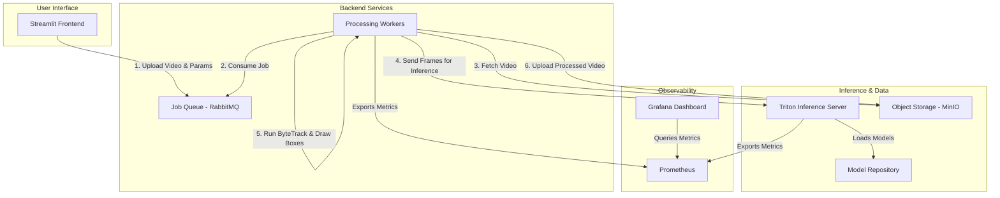

# Shibuya Crossing 🚶‍♂️🚦

**A Scalable, Interactive Platform for High-Performance Video Object Detection and Tracking.**

This project provides a complete, containerized system for processing large volumes of video files. It uses state-of-the-art YOLO models for object detection and ByteTrack for robust multi-object tracking. The entire system is designed as a set of microservices orchestrated by Docker Compose, ensuring portability, scalability, and ease of deployment.

The name "Shibuya Crossing" is inspired by the famous Tokyo intersection, symbolizing the project's capability to handle crowded and complex scenes with a high number of objects to detect and track simultaneously.


---

## Table of Contents
- [Shibuya Crossing 🚶‍♂️🚦](#shibuya-crossing-️)
  - [Table of Contents](#table-of-contents)
  - [🌟 Features](#-features)
  - [🎬 Demo](#-demo)
  - [🏗️ System Architecture](#️-system-architecture)
  - [🛠️ Technology Stack](#️-technology-stack)
  - [🚀 Getting Started](#-getting-started)
    - [Prerequisites](#prerequisites)
    - [Installation \& Setup](#installation--setup)
  - [💻 How to Use](#-how-to-use)
  - [🔗 Service Endpoints](#-service-endpoints)
  - [📈 Scalability \& Performance](#-scalability--performance)
  - [📊 Observability](#-observability)
  - [🔮 Future Work](#-future-work)

---

## 🌟 Features

*   **Interactive Frontend:** An easy-to-use [Streamlit](https://streamlit.io/) web UI for uploading videos and configuring processing parameters.
*   **High-Performance Inference:** Leverages [NVIDIA Triton Inference Server](https://developer.nvidia.com/nvidia-triton-inference-server) to serve YOLO models on GPU for maximum throughput.
*   **State-of-the-Art CV Models:**
    *   **Object Detection:** Supports various YOLO models (YOLOv5, YOLOv8, etc.) in ONNX format.
    *   **Object Tracking:** Implements [ByteTrack](https://github.com/ifzhang/ByteTrack) for reliable tracking, even with occlusions.
*   **Asynchronous & Scalable Backend:** A robust job queue system ([RabbitMQ](https://www.rabbitmq.com/)) with distributed Python workers allows for parallel processing of thousands of files.
*   **Containerized & Portable:** The entire application stack is defined in `docker-compose.yml` for one-command setup and consistent environments.
*   **Built-in Observability:** Real-time monitoring of system health, GPU utilization, and job throughput with [Prometheus](https://prometheus.io/) and [Grafana](https://grafana.com/).
*   **S3-Compatible Storage:** Uses [MinIO](https://min.io/) for scalable storage of input and output video files.

## 🎬 Demo

*(Here you would embed a GIF showing the user uploading a video to the Streamlit interface and the resulting processed video with tracking boxes.)*

**Streamlit UI:**


**Example Output:**


## 🏗️ System Architecture

The project follows a microservices architecture, where each component is a separate container responsible for a specific task. This design promotes scalability and fault tolerance.



## 🛠️ Technology Stack

*   **Frontend:** Streamlit
*   **Computer Vision:** OpenCV, NumPy
*   **Object Detection:** YOLO (v5, v8, etc.) in ONNX format
*   **Object Tracking:** ByteTrack
*   **Inference Serving:** NVIDIA Triton Inference Server
*   **Job Queuing:** RabbitMQ
*   **Containerization:** Docker, Docker Compose
*   **Observability:** Prometheus, Grafana
*   **Object Storage:** MinIO

## 🚀 Getting Started

### Prerequisites
*   [Docker](https://www.docker.com/get-started) and [Docker Compose](https://docs.docker.com/compose/install/)
*   An NVIDIA GPU with drivers installed.
*   [NVIDIA Container Toolkit](https://docs.nvidia.com/datacenter/cloud-native/container-toolkit/install-guide.html) installed to enable GPU access for Docker containers.
*   `git` for cloning the repository.

### Installation & Setup

**Step 1: Clone the Repository**
```bash
git clone https://github.com/your-username/shibuya-crossing.git
cd shibuya-crossing
```

**Step 2: Prepare the Model Repository**
The Triton Inference Server requires a specific directory structure for its models. You must provide your own exported ONNX models.

1.  Create the model directory:
    ```bash
    mkdir -p model_repository
    ```
2.  For each model you want to serve, create a subdirectory and place the `model.onnx` file and a `config.pbtxt` inside.
    ```
    model_repository/
    └── yolov8n/              # Model name
        ├── 1/                # Version number
        │   └── model.onnx
        └── config.pbtxt      # Triton configuration file
    ```
    > **Note:** A valid `config.pbtxt` is **required**. It tells Triton about the model's inputs, outputs, and batching strategy. Refer to the [Triton documentation](https://github.com/triton-inference-server/server/blob/main/docs/user_guide/model_configuration.md) for details.

**Step 3: Configure Environment Variables**
Copy the example environment file and customize it if needed (the defaults should work for local development).
```bash
cp .env.example .env
```

**Step 4: Build and Run the Services**
This single command will pull all necessary images, build your custom service images, and start the entire stack.
```bash
docker-compose up --build -d
```
The initial build might take several minutes. Once it's done, all services will be running in the background (`-d`).

## 💻 How to Use

1.  **Open the Frontend:** Navigate to `http://localhost:8501` in your web browser.
2.  **Upload Video:** Use the file uploader to select a video file (`.mp4`, `.avi`, etc.).
3.  **Configure Parameters:**
    *   Select the desired YOLO model from the dropdown.
    *   Adjust the confidence and IOU thresholds.
    *   Set any specific tracking parameters.
4.  **Submit Job:** Click the "Process Video" button.
5.  **Monitor:** The UI will show the job status as "Queued" and then "Processing". You can also monitor the overall system performance via Grafana (see below).
6.  **Download Result:** Once the job is "Complete", a download link for the processed video will appear.

## 🔗 Service Endpoints

Once the stack is running, you can access the various services at these local endpoints:

| Service             | URL                             | Credentials                | Description                                |
| ------------------- | ------------------------------- | -------------------------- | ------------------------------------------ |
| **Streamlit UI**    | `http://localhost:8501`         | -                          | Main user interface for submitting jobs.   |
| **Grafana**         | `http://localhost:3000`         | `admin` / `admin`          | Dashboards for system monitoring.          |
| **RabbitMQ Mgmt**   | `http://localhost:15672`        | `guest` / `guest`          | UI to inspect queues and message flow.     |
| **MinIO Console**   | `http://localhost:9001`         | `minioadmin` / `minioadmin`| UI to browse stored video files.           |
| **Triton Metrics**  | `http://localhost:8002/metrics` | -                          | Prometheus-compatible metrics endpoint.    |

## 📈 Scalability & Performance

This architecture is designed for parallel processing. The bottleneck in video processing is typically the compute-intensive CV task. You can easily scale the number of processing workers to match your hardware capabilities.

To increase the number of workers to 5, for example, run:
```bash
docker-compose up --scale worker=5 -d
```
This will start 4 new worker containers, which will immediately start consuming jobs from the RabbitMQ queue, dramatically increasing the system's overall throughput.

## 📊 Observability

A pre-configured Grafana dashboard is available to monitor the health and performance of the entire system.

*   **Access:** Go to `http://localhost:3000`.
*   **Dashboard:** Find the "Shibuya Crossing System Overview" dashboard.
*   **Key Metrics:**
    *   **GPU Utilization & Memory:** Monitor your GPU's load in real-time.
    *   **Inference Performance:** Track Triton's inference latency and throughput.
    *   **Job Queue Depth:** See how many videos are waiting to be processed in RabbitMQ.
    *   **Worker Throughput:** See how many frames per second (FPS) each worker is processing.

## 🔮 Future Work

*   [ ] **Real-time Stream Processing:** Adapt the workers to process RTSP or webcam streams instead of static files.
*   [ ] **Kubernetes Deployment:** Create Helm charts for deploying the system to a Kubernetes cluster for auto-scaling and better resource management.
*   [ ] **More Tracking Algorithms:** Add support for other trackers like DeepSORT.
*   [ ] **Advanced API:** Develop a more comprehensive FastAPI backend to allow programmatic job submission and status checks.
*   [ ] **User Authentication:** Add an authentication layer for multi-tenant or secure deployments.
