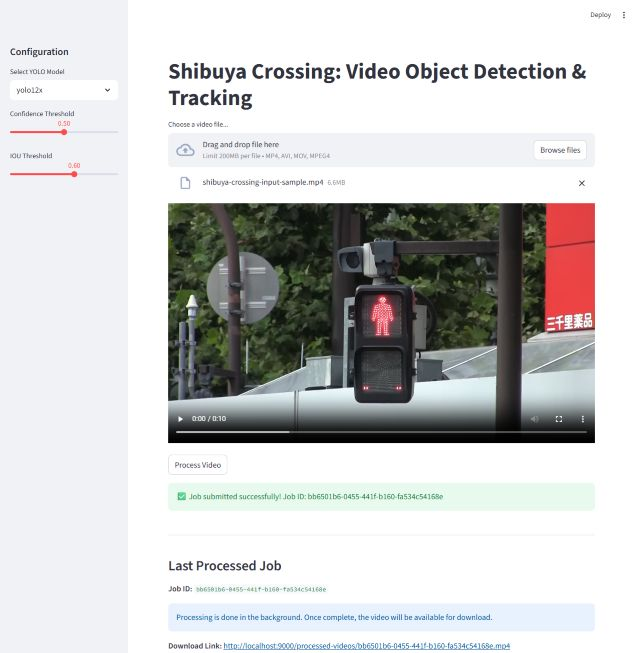
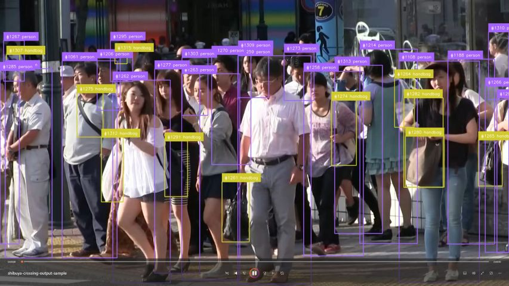
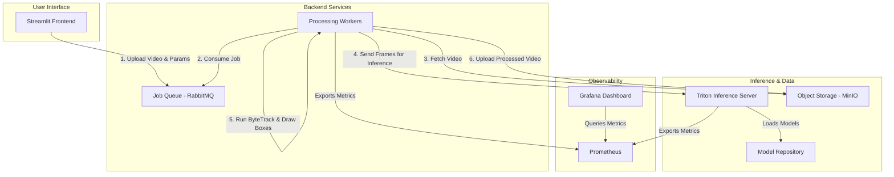

# Shibuya Crossing: Object Detection and Tracking

[](https://github.com/DouglasAltwig/Data-Science-MicroProjects)
[](https://github.com/DouglasAltwig/Data-Science-MicroProjects)
[](https://opensource.org/licenses/MIT)

**A scalable, asynchronous pipeline for advanced content analysis and data extraction.**

This project provides a complete, containerized system for processing large volumes of video files. It uses state-of-the-art YOLO models for object detection and ByteTrack for robust multi-object tracking. The entire system is designed as a set of microservices orchestrated by Docker Compose, ensuring portability, scalability, and ease of deployment. The project is designed to handle heavy computational tasks by distributing work across multiple workers, making it ideal for video analysis, large-document processing, or complex simulations.

---

## Table of Contents
- [Shibuya Crossing: Object Detection and Tracking](#shibuya-crossing-object-detection-and-tracking)
  - [Table of Contents](#table-of-contents)
  - [🎬 Demonstration](#-demonstration)
  - [🌟 Features](#-features)
  - [🏗️ How It Works: System Architecture](#️-how-it-works-system-architecture)
  - [🛠️ Technology Stack](#️-technology-stack)
  - [🚀 Getting Started](#-getting-started)
    - [Prerequisites](#prerequisites)
    - [Installation \& Setup](#installation--setup)
  - [💻 How to Use](#-how-to-use)
    - [1. Using the Streamlit Web Interface (Recommended)](#1-using-the-streamlit-web-interface-recommended)
    - [2. Submitting a Job via API (`curl`)](#2-submitting-a-job-via-api-curl)
  - [🔗 Service Endpoints](#-service-endpoints)
  - [⚙️ Configuration](#️-configuration)
  - [📈 Scalability \& Performance](#-scalability--performance)
  - [📊 Observability](#-observability)
  - [🤝 Contributing](#-contributing)
  - [📄 License](#-license)
  - [📧 Contact](#-contact)

---

## 🎬 Demonstration

Here is a sample of the application's input and the resulting output after processing.

| Input Sample | Output Sample |
| :---: | :---: |
| [Watch Input Video](https://drive.google.com/file/d/1gYwxdOmu8fpUrv8Kpuy45Isfa65k_-db/view?usp=drive_link) | [Watch Processed Video](https://drive.google.com/file/d/1rJI918OgOvnRr6qcKUPi7eHIMG6s1APx/view?usp=drive_link) |
|  |  |


## 🌟 Features

*   **Asynchronous Processing:** Utilizes RabbitMQ to queue and handle intensive tasks without blocking the main application.
*   **Scalable Architecture:** Easily scale worker services horizontally to handle increased processing loads.
*   **GPU Accelerated:** Optimized for NVIDIA GPUs via the Triton Inference Server to dramatically speed up AI/ML model inference.
*   **RESTful API:** A simple and intuitive FastAPI for submitting jobs programmatically.
*   **Interactive Frontend:** An easy-to-use Streamlit web UI for uploading videos and configuring processing parameters.
*   **Containerized:** Fully containerized with Docker for easy, one-command setup and consistent deployment across environments.

## 🏗️ How It Works: System Architecture

The project follows a microservices architecture where each component is a separate container responsible for a specific task. This design promotes scalability and fault tolerance.



**Component Roles:**
*   **Streamlit Frontend:** The main user interface for uploading videos and setting processing parameters.
*   **API Server (FastAPI):** Receives requests from the frontend, uploads the raw video to MinIO, and publishes a processing job to the RabbitMQ queue.
*   **RabbitMQ (Message Queue):** Decouples the API from the workers. It holds jobs in a queue until a worker is free to process them, ensuring reliability.
*   **Processing Workers:** Python applications that consume jobs from RabbitMQ. They download the video, perform frame-by-frame inference using Triton, apply object tracking, and upload the final annotated video back to MinIO.
*   **Triton Inference Server:** Serves the ONNX-formatted YOLO models on the GPU, providing high-throughput, low-latency inference.
*   **MinIO (Storage):** An S3-compatible object storage used to store the raw input videos and the processed output videos.
*   **Prometheus & Grafana (Observability):** Prometheus scrapes metrics from the workers and Triton, while Grafana provides pre-configured dashboards to visualize system health and performance.

## 🛠️ Technology Stack

*   **Frontend:** Streamlit
*   **Backend:** FastAPI
*   **Computer Vision:** OpenCV, NumPy
*   **Object Detection:** YOLO (v5, v8, etc.) in ONNX format
*   **Object Tracking:** ByteTrack
*   **Inference Serving:** NVIDIA Triton Inference Server
*   **Job Queuing:** RabbitMQ
*   **Object Storage:** MinIO
*   **Observability:** Prometheus, Grafana
*   **Containerization:** Docker, Docker Compose

## 🚀 Getting Started

Follow these steps to get the project running locally.

### Prerequisites
*   [Git](https://git-scm.com/)
*   [Docker](https://www.docker.com/get-started) and [Docker Compose](https://docs.docker.com/compose/install/)
*   An NVIDIA GPU with the latest drivers installed.
*   [NVIDIA Container Toolkit](https://docs.nvidia.com/datacenter/cloud-native/container-toolkit/install-guide.html) to enable GPU access for Docker containers.

> **Hardware Recommendation**
>
> An **NVIDIA graphics card is highly recommended** to leverage GPU acceleration. The application will be significantly slower on a CPU-only machine.

### Installation & Setup

1.  **Clone the Repository**
    ````bash
    git clone https://github.com/DouglasAltwig/Data-Science-MicroProjects.git
    ````

2.  **Navigate to the Project Directory**
    ````bash
    cd Data-Science-MicroProjects/shibuya-crossing/
    ````

3.  **Build and Run the Application**
    This single command builds all the container images and starts the entire service stack in the background.
    ````bash
    docker-compose up --build -d
    ````

> **Performance Warning**
>
> The initial build and startup can take **several minutes** as Docker downloads base images and installs dependencies. Processing a video can also be time-consuming, depending on your computer's processing power and the video's length.

## 💻 How to Use

There are two ways to interact with the application: through the web interface or programmatically via the API.

### 1. Using the Streamlit Web Interface (Recommended)

1.  **Open the Frontend:** Navigate to **`http://localhost:8501`** in your web browser.
2.  **Upload Video:** Use the file uploader to select a video file (`.mp4`, `.avi`, etc.).
3.  **Configure Parameters:** Select the desired YOLO model and adjust the confidence/IOU thresholds in the sidebar.
4.  **Submit Job:** Click the "Process Video" button.
5.  **Download Result:** A download link for the processed video will appear once the job is complete.

### 2. Submitting a Job via API (`curl`)

You can also submit jobs directly to the FastAPI backend.

```bash
curl -X 'POST' \
  'http://localhost:8000/process-video/' \
  -H 'accept: application/json' \
  -F 'file=@/path/to/your/video.mp4' \
  -F 'model=yolo12n' \
  -F 'conf_thresh=0.5' \
  -F 'iou_thresh=0.6'
```
The API will respond with a job_id. You can monitor the MinIO Console (http://localhost:9001) for the output file, which will be named {job_id}.mp4.

## 🔗 Service Endpoints
Once the stack is running, you can access the various services at these local endpoints:

| Service             | URL                             | Credentials                | Description                                |
| ------------------- | ------------------------------- | -------------------------- | ------------------------------------------ |
| **Streamlit UI**    | `http://localhost:8501`         | -                          | Main user interface for submitting jobs.   |
| **Grafana**         | `http://localhost:3000`         | `admin` / `admin`          | Dashboards for system monitoring.          |
| **RabbitMQ Mgmt**   | `http://localhost:15672`        | `guest` / `guest`          | UI to inspect queues and message flow.     |
| **MinIO Console**   | `http://localhost:9001`         | `minioadmin` / `minioadmin`| UI to browse stored video files.           |
| **Triton Metrics**  | `http://localhost:8002/metrics` | -                          | Prometheus-compatible metrics endpoint.    |

## ⚙️ Configuration
You can configure the number of processing workers to match your hardware capabilities.

To change the number of worker instances, modify the replicas value under the worker service in the docker-compose.yml file and restart the services.
```yml
// filepath: docker-compose.yml
// ...existing code...
  worker:
    build: ./worker
// ...existing code...
    deploy:
      replicas: 3 # <-- Change this value to scale workers
// ...existing code...
```

## 📈 Scalability & Performance
This architecture is designed for parallel processing. The decoupled nature of the workers and the message queue allows for easy horizontal scaling. The bottleneck in video processing is typically the compute-intensive inference task, which is why scaling the workers is effective.

You can dynamically scale the number of workers without rebuilding the images. For example, to increase the number of workers to 5, run:

```bash
docker-compose up --scale worker=5 -d
```

This will start new worker containers that will immediately start consuming jobs from the RabbitMQ queue, dramatically increasing the system's overall throughput. Performance is heavily influenced by the underlying hardware, especially the GPU.

## 📊 Observability

Logging

You can view the logs for all running services with:
```bash
docker-compose logs -f
```
To view logs for a specific service (e.g., the worker), use:
```bash
docker-compose logs -f worker
```
Metrics and Monitoring
A pre-configured Grafana dashboard is available to monitor the health and performance of the entire system.

* Access: Go to http://localhost:3000.
* Dashboard: Find the "Shibuya Crossing System Overview" dashboard.
* Key Metrics:
    * GPU Utilization & Memory: Monitor your GPU's load in real-time.
    * Inference Performance: Track Triton's inference latency and throughput.
    * Job Queue Depth: See how many videos are waiting to be processed in RabbitMQ.
    * Worker Throughput: See how many frames per second (FPS) each worker is processing.

Health Checks
The API provides a simple health check endpoint to verify that the service is running:

- http://localhost:8000/health

## 🤝 Contributing
Contributions are welcome! Please feel free to submit a pull request or open an issue to discuss potential changes or additions.

## 📄 License
This project is licensed under the MIT License. See the LICENSE file for details.

## 📧 Contact
Douglas Altwig - GitHub - douglas.altwig@gmail.com